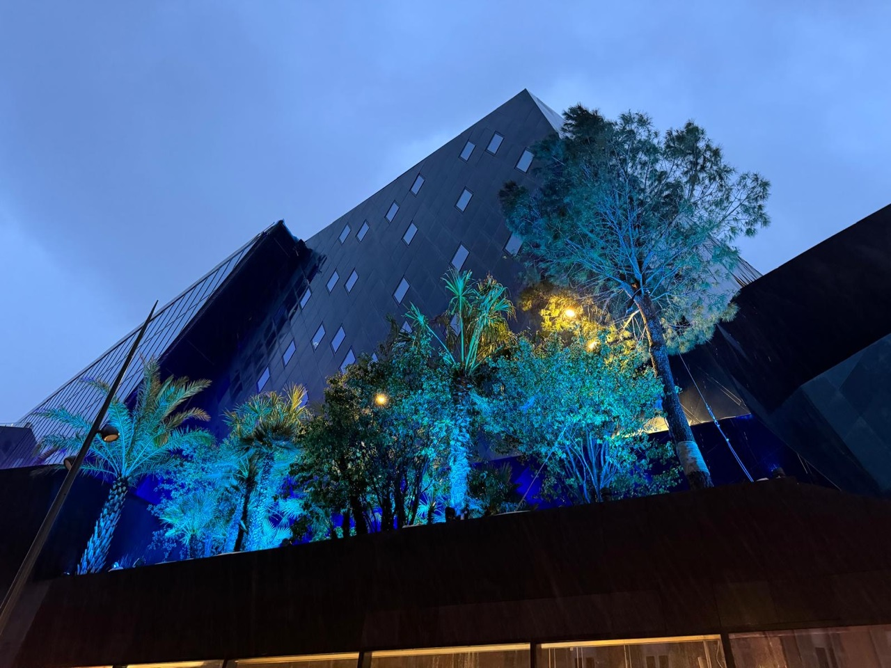
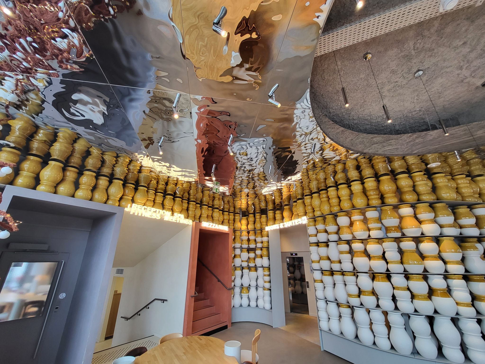
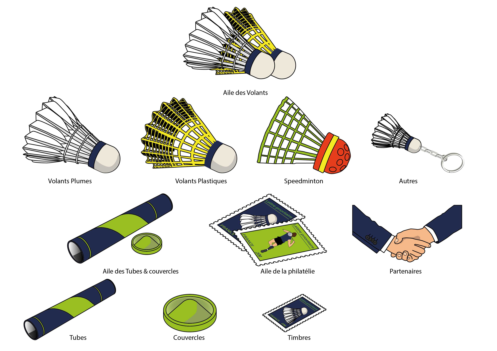

<h1 align="center">Hello world ! 👋</h1>

<h3 align="center">Walking on the path to immersive systems (VR/AR/MR/XR)</h3>

<!--
**olivier-portal/olivier-portal** is a ✨ _special_ ✨ repository because its `README.md` (this file) appears on your GitHub profile.

Here are some ideas to get you started:

- 🔭 I’m currently working on ...
- 🌱 I’m currently learning ...
- 👯 I’m looking to collaborate on ...
- 🤔 I’m looking for help with ...
- 💬 Ask me about ...
- 📫 How to reach me: ...
- 😄 Pronouns: ...
- ⚡ Fun fact: ...
-->

  

  

# My story :

## Carrer and passion for design

With solid experience as an industrial designer, graphic designer, and web designer, I have always been involved in creating aesthetic and functional solutions. Every project I undertake is guided by a passion for detail and innovation, combining creativity and pragmatism to meet the needs of clients and users.

## A new path towards immersive technologies

Recently, I decided to take on a new challenge by resuming my studies in the field of IT, with a specialization in immersive technologies (VR, AR, MR, XR). This transition is motivated by my fascination with new technologies and the exciting possibilities they offer in terms of interactive and immersive experiences. This choice enriches my career as a designer, allowing me to merge creativity with cutting-edge technical skills.

## Objective: a work-study program to combine theory and practice

Currently in the first year of an IT bachelor's degree specializing in immersive technologies, I am looking for a work-study program lasting one week in school and four weeks in a company. This experience would allow me to apply my skills in developing immersive systems, while benefiting from the support and advice of experts in the field. Working in a company would also strengthen my understanding of real-world applications in immersive technology and allow me to contribute from the beginning of my training.

## A polyvalent profile ready to invest

With my background in industrial and digital design, I am versatile, adaptable, and passionate about innovation. I bring a unique perspective that combines a developed aesthetic sense with a solid understanding of immersive technologies. By joining your team, I am ready to fully invest in bringing my skills to the table, while developing my expertise in a stimulating professional environment.

---

<h3 align="left">Connect with me:</h3>

---

<h3 align="left">Languages and Tools:</h3>

              

---

&nbsp;

---

> *"Just as when two clashing musical notes played together force a piece of music forward, so discord in our thoughts, ideas and values compel us to think, re-evaluate and criticise. Consistency is the playground of dull minds."*

*Yuval Noah Harari*

---

- 🌱 I’m currently learning immersive technology development at La plateforme, Marseille, France

- 👨‍💻 All of my design projects from my old jobs are available at [https://www.design-portal.fr/](https://www.design-portal.fr/)

- 😄 All of my projects from my new job are available (lots to come) at [https://olivier-portal.github.io/cyber-portal/](https://olivier-portal.github.io/cyber-portal/)

- 📫 How to reach me **olivier.portal@laplateforme.io**

- ⚡ Fun fact: Since I bought my first Raspberry Pi I'm transforming my home into a smart one 😄 .... Next project : making a smart touch screen mirror !!!

---

# Portfolio :

## Industrial design :

### For Harmony-DML :
<section display="flex">

</section>

---

### For GK Pro :

<section display="flex">

</section>

---
### For Ancilia :
<section display="flex">

</section>

---
## Architecture :

### For citynox :
<section display="flex">

</section>

---
## Graphic design :

### For different clients :
<section display="flex">

</section>

---

## Web design :

### For different clients :
<section display="flex">

</section>

---
